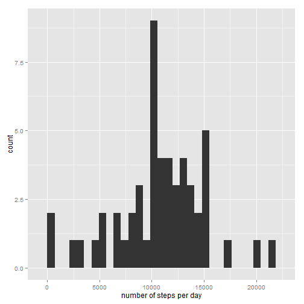
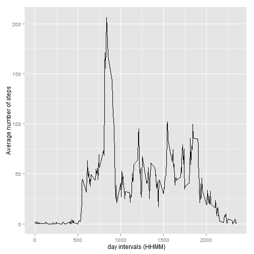
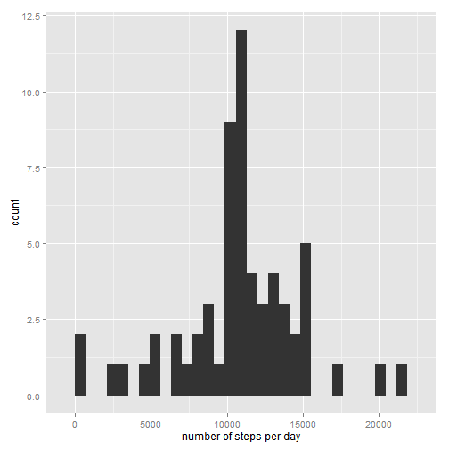
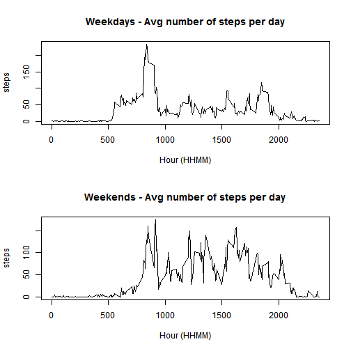

Assigment 1 - Reproducible Research
--------------


Let's read the data and put the dates in the right format:


```r
data<-read.csv("activity.csv")
data$date<-as.Date(data$date,"%Y-%m-%d")
```
Let's call the needed packages for this exercise:

```r
library(ggplot2)
library(dplyr)
```


# Question 1: What is mean total number of steps taken per day?  

1. Let's build a dataframe which contains the number of steps per day  

```r
q1<- data %>% group_by(date) %>% summarize(nsteps=sum(steps))
head(q1,3)
```

```
## Source: local data frame [3 x 2]
## 
##         date nsteps
##       (date)  (int)
## 1 2012-10-01     NA
## 2 2012-10-02    126
## 3 2012-10-03  11352
```

2. Now, let's plot the Histogram  

```r
qplot(q1$nsteps,geom="histogram", xlab="number of steps per day")
```

```
## stat_bin: binwidth defaulted to range/30. Use 'binwidth = x' to adjust this.
```

 

3. ... and compute the mean and the median  

```r
mean<-mean(q1$nsteps,na.rm=TRUE)
mean
```

```
## [1] 10766.19
```

```r
median<-median(q1$nsteps, na.rm=TRUE)
median
```

```
## [1] 10765
```

# Question 2: What is the average daily activity pattern?
  
1. Let's make a dataframe containing the average number of steps per 5-minutes intervals  

```r
q2<- data %>% group_by(interval) %>% summarize(avgsteps=mean(steps,na.rm=TRUE))  
```
and plot the correponding time series graph

```r
ggplot(q2,aes(interval,avgsteps)) + geom_line() + xlab(" day intervals (HHMM)") + ylab("Average number of steps")
```

 
2. Which 5-minute interval, on average across all the days in the dataset, contains the maximum number of steps?   

```r
maxSteps<-q2$interval[max(q2$avgsteps)]
maxSteps
```

```
## [1] 1705
```

# Question 3: Imputing missing values  

1. Calculate and report the total number of missing values in the dataset (i.e. the total number of rows with NAs)

```r
nbNA<-length(data$steps[is.na(data$steps)])
nbNA
```

```
## [1] 2304
```
2. Let's create a new dataset in which all the NA values are replaced by the average number of steps

```r
data2<-data
data2$steps[is.na(data2$steps)]<-mean(data2$step,na.rm=TRUE)
q3<- data2 %>% group_by(date) %>% summarize(nsteps=sum(steps))
qplot(q3$nsteps,geom="histogram", xlab="number of steps per day")
```

```
## stat_bin: binwidth defaulted to range/30. Use 'binwidth = x' to adjust this.
```

 
4. And compute the mean and the median

```r
mean<-mean(q3$nsteps,na.rm=TRUE)
mean
```

```
## [1] 10766.19
```

```r
median<-median(q3$nsteps, na.rm=TRUE)
median
```

```
## [1] 10766.19
```
We can see that the mean is the same than previously. However, the median has changed.  


# Question 4: Are there differences in activity patterns between weekdays and weekends?  

1. Let's make 2 dataframes containing the average number of steps per day, respectively for weekdays and weekend days. 

```r
weekdays<- data %>% filter(weekdays(date) %in% c('lundi','mardi','mercredi','jeudi','vendredi')) %>% 
        group_by(interval) %>% summarize(avgsteps=mean(steps,na.rm=TRUE))

weekends<-data %>% filter(weekdays(date) %in% c('samedi','dimanche')) %>% 
        group_by(interval) %>% summarize(avgsteps=mean(steps,na.rm=TRUE))

head(weekdays,3)
```

```
## Source: local data frame [3 x 2]
## 
##   interval  avgsteps
##      (int)     (dbl)
## 1        0 2.3333333
## 2        5 0.4615385
## 3       10 0.1794872
```

```r
head(weekends,3)
```

```
## Source: local data frame [3 x 2]
## 
##   interval avgsteps
##      (int)    (dbl)
## 1        0        0
## 2        5        0
## 3       10        0
```
2. Now, let's plot the graphs in order to see the differences of patterns between weekdays and weekend days. 

```r
par(mfrow=c(2,1))
plot(weekdays$interval, weekdays$avgsteps,type="l",main="Weekdays - Avg number of steps per day", ylab="steps", xlab="Hour (HHMM)")
plot(weekends$interval, weekends$avgsteps,type="l",main="Weekends - Avg number of steps per day", ylab="steps", xlab="Hour (HHMM)")
```

 
